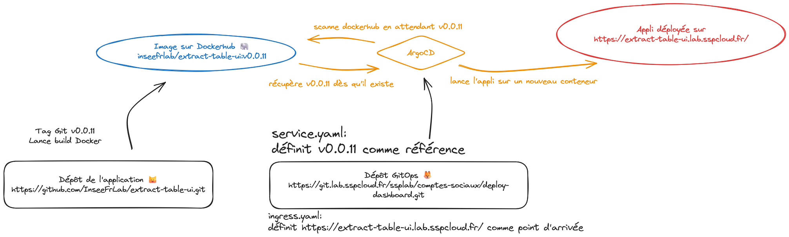
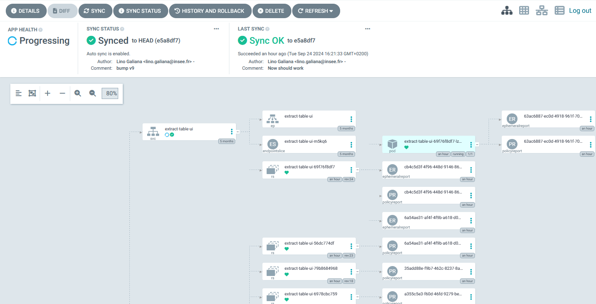

# Documentation pour mettre à jour la version déployée

> [!NOTE]
> On va supposer dans ce document qu'une modification a été faite sur l'application, qu'elle
a été testée et validée à partir d'un `streamlit run` en local.
> 
> L'objectif est de passer à la mise en production, c'est-à-dire à
mettre à jour la version livrée sur https://extract-table-ui.lab.sspcloud.fr/

La démarche à suivre est la suivante, décrite plus en détail ci-dessous:

1. Effectuer un _tag_ sur ce dépôt pour figer une version
2. Mettre à jour la version utilisée dans le dépôt `GitOps` gérant le déploiement

## Prolégomène à tout déploiement futur

Deux dépôts interagissent ensemble pour permettre de mettre à jour l'application visible sur https://extract-table-ui.lab.sspcloud.fr/

1. Le code applicatif sur https://github.com/InseeFrLab/extract-table-ui.git. Celui-ci gère la construction de l'image Docker encapsulant notre application.
2. Le code gérant le déploiement sur https://git.lab.sspcloud.fr/ssplab/comptes-sociaux/deploy-dashboard.git. On parle à ce propos de dépôt `GitOps`. Il s'agit du dépôt qui consomme l'image Docker produite précédemment et la met à disposition sur un site web.

Le second dépôt est surveillé par notre `ArgoCD` disponible dans le namespace `projet-extraction-tableaux`. Celui-ci fait la passerelle entre l'image `Docker` (la configuration machine qui permettra de faire tourner notre application sur des serveurs _ad hoc_ quand on le voudra) et la version en production sur https://extract-table-ui.lab.sspcloud.fr/. Le dépôt `GitOps` dit à Argo ce qu'il doit faire: quelle image Docker il faut utiliser, quels paramètres derrière (S3, MLFlow, etc.) et où mettre à disposition la version de production. 

Une version résumée du _pipeline_ est faite ci-dessous:



## 1. Effectuer un _tag_ sur ce dépôt pour figer une version

La version déployée sur https://extract-table-ui.lab.sspcloud.fr/ n'est pas mise à jour automatiquement, ceci risquerait 
de la rendre instable, plus sujette aux bugs. La bonne pratique de mise en production est de mettre volontairement en production certaines versions plutôt que de mettre en continu `latest` en production. 

Pour faire cela, on utilise un _tag_ git. Après avoir fait un commit sur `main` pour enregistrer les dernières modifications, on peut créer un tag en suivant la démarche ci-dessous. On va supposer que le tag à créer est `v0.0.11`

```python
# Etape pour rappeler qu'il faut committer sur main d'abord
cd extract-table-ui
git add -u
git commit -m "Dernière modification dont je suis content"
git push origin main

git tag -a v0.0.11 -m "Version ajoutant quelques fonctionnalités: blablabla"
git push origin v0.0.11
```

## 2. Mettre à jour la version utilisée dans le dépôt `GitOps` gérant le déploiement

Il suffit de changer la version utilisée dans le fichier `deployment.yml` puis committer et pusher
et la nouvelle version sera déployée. 

Dans le fichier `deployment.yml`, la déclaration à faire est ici

```python
# ...
spec:
    # ...
    spec:
      containers:
        - name: dashboard
          image: inseefrlab/extract-table-ui:v0.0.11 #la version à mettre à jour ici
          imagePullPolicy: Always
```

Après avoir édité ce fichier, il suffit de _committer_ et _pusher_

```python
cd deploy-dashboard
git add -u
git commit -m "Bump version 0.0.11"
git push origin main
```

Après quelques instants, la nouvelle version devrait être en ligne sur https://extract-table-ui.lab.sspcloud.fr/. En effet,
la mise à jour du dépôt déclenche une séquence d'opérations gérées par Argo: lancement d'un nouveau processus encapsulant la version Docker définie dans `deployment.yml`, etc.

On peut vérifier que tout fonctionne bien dans le déploiement en allant sur l'interface d'Argo depuis [l'onglet Mes Services](https://datalab.sspcloud.fr/my-services)



Si la dernière mise à jour du dépôt `GitOps` n'est pas visible, il est possible de forcer la synchronisation en cliquant sur le bouton adapté. Normalement, après quelques secondes, le site web https://extract-table-ui.lab.sspcloud.fr/ devrait être à jour (le tag s'affiche sur la page d'accueil). 